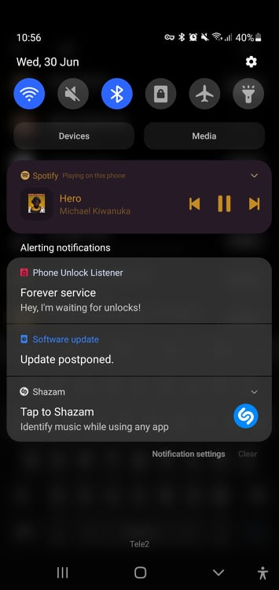

# Phone Unlock Listener

## A very-specific-case hacky Android app and hacky Flask API for listening to phone unlocks and then sending them to the API

## The live product: https://howmanytimeshaveiunlockedmyphonetoday.rasimas.lt/

## Features
### App:
- listens for 'android.intent.USER_PRESENT' via a BroadcastReceiver and when it hears it, sends an empty POST to the private API
- has a on/off switch in the activity screen, if you'd like to stop sharing the unlocks with the world
- has a reset button in the activity screen, if you need to zero the count for some reason
- ForeverService (which listens for intent and sends the requests) sits in the notification bar forever as a foreground service
- StartReceiver listens for intent 'ACTION_BOOT_COMPLETED' and runs the service when the boot is completed (after restart)

### Website:
- fetches new phone unlock count every 50ms

### API:
- listens for POST|GET requests either for reset/increase or count retrieval

### Database

The public and private APIs interface with a text file instead of a database. "But what about race conditions?" - I thought that this was one of those instances where:
1. A hack is good enough
2. Only my device can call the API (on unlocks), so race conditions shouldn't happen
3. I don't mind if it's not robust

### Server

- cronjob that zeroes the count every day at midnight.
- systemd file that runs and, if-needs-be, restarts the **uwsgi** application server for the API

### Endpoints
- /api/increase POST (private) Increase phone unlock count
- /api/reset POST (private) Reset phone unlock count
- /api/ GET (public) Get phone unlock count

## The idea
The Android app listens to phone unlocks in the foreground as a service. It's permanently lodged in the notification bar to never get recycled by the all-consuming-tornado that is Samsung's battery optimization. When it hears the unlock (with the help of a BroadcastReceiver) it then sends a POST request to my private API that resides in a VPS. The gateway manager NGINX only allows my static IP to go through to the private API (so no authentication of any kind is needed there). The Python API then updates the score in a text file.

When a user goes to the webpage the browser fetches information from the public API. That is done using a mini-script that I put in the script tag of the HTML page. In it, we have a 'fetch' call and a setTimeout that re-requests the information every few ms (makes the page feel dynamic).

## Technologies used
- Python
- Flask
- uwsgi
- Nginx
- Android SDK + Kotlin
- ES6
- Cron
- Systemd

